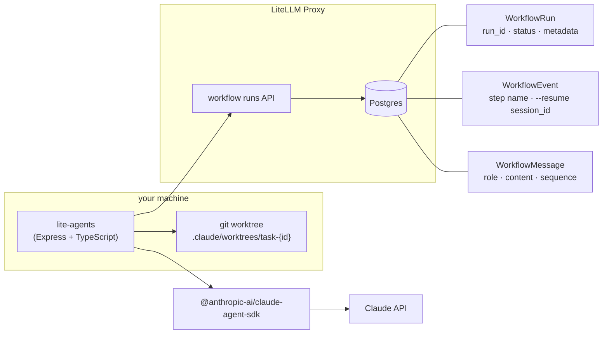

# lite-agents

Run AI agents without managing infrastructure.

Kill the server mid-run. Restart. Pick up where you left off.

---

Every run is stored in LiteLLM proxy — status, conversation history, the Claude `--resume` session ID. On restart, active runs recover automatically. No state lives in memory.

You get:

- **durable runs** — survive restarts, resume after crashes
- **conversation history** — full message log per run, queryable
- **isolated memory** — each task gets its own git worktree; state never leaks between runs
- **cron** — schedule agents on a recurring trigger via LiteLLM proxy

No database to set up, no queue to run, no state management to write. LiteLLM proxy handles it.

---

## How it works

```
describe issue
      │
      ▼
  ┌───────┐   clarifying     ┌──────┐
  │ Grill │ ──questions──▶   │ You  │
  │       │ ◀──approve/fix── │      │
  └───────┘                  └──────┘
      │ approved
      ▼
  ┌──────┐    plan ready     ┌──────┐
  │ Plan │ ──────────────▶   │ You  │
  │      │ ◀───approve────── │      │
  └──────┘                   └──────┘
      │ approved
      ▼
  ┌──────────┐
  │ Implement│ ──▶ git worktree ──▶ PR
  └──────────┘
```

Three stages, each a human approval gate. Kill the server at any point — restart and every run picks back up from its last checkpoint.

---

## Infra



`WorkflowEvent.data.session_id` is the Claude `--resume` ID. That's what makes kill-and-resume work.

---

## Get started

### 1. Scaffold

```bash
npx lite-agents init my-agent
cd my-agent
npm install
```

Or clone directly:

```bash
git clone https://github.com/BerriAI/lite-agents
cd lite-agents
npm install
```

### 2. Configure

```bash
cp .env.example .env
```

```env
LITELLM_PROXY_URL=http://localhost:4000
LITELLM_API_KEY=sk-...
REPO_PATH=/path/to/your/git/repo   # the repo the agent will work in
PORT=8001
```

`REPO_PATH` is the git repository the agent checks out worktrees from. It can be any repo — not just LiteLLM.

### 3. Add skills

Skills are `.md` files injected into agent prompts. Drop them in `skills/` — they load automatically:

```
skills/
  grill_me.md      # how the agent clarifies requirements
  plan_repro.md    # how the agent plans a fix
  implement.md     # how the agent executes
```

Edit these to change agent behaviour without touching code.

### 4. Plug in your agent

`src/agent.ts` is the only file you touch to swap agent implementations:

```typescript
// src/agent.ts
export { claudeCodeAgent as agent } from "./agents/claude-code.js";
```

Default: Claude Code via `@anthropic-ai/claude-agent-sdk` — the most widely adopted Claude agent SDK.

To use your own agent, implement `AgentEntrypoint` from `src/agent-spec.ts`:

```typescript
import type { AgentEntrypoint } from "./agent-spec.js";

export const agent: AgentEntrypoint = async function*(prompt, { cwd, resumeId }) {
  // yield AgentMessage events as your agent works
  // resumeId is set when resuming an interrupted run
  yield { type: "text", text: "done" };
};
```

Any agent implementation works — PydanticAI over HTTP, LangGraph, raw API calls, whatever.

### 5. Run

```bash
npm start
```

Open http://localhost:8001

---

## Env vars

| Var | Required | Default |
|-----|----------|---------|
| `LITELLM_PROXY_URL` | yes | — |
| `LITELLM_API_KEY` | yes | — |
| `REPO_PATH` | yes | — |
| `PORT` | no | `8001` |

## Requirements

- Node.js 20+
- LiteLLM proxy with workflow runs API enabled
- Claude Code CLI (for the default agent): `claude auth login`
